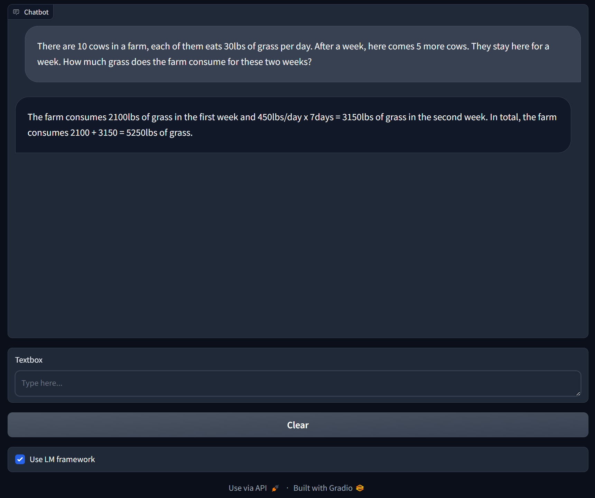
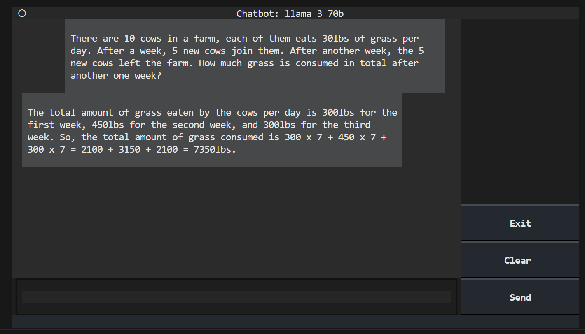

<p align="center">
  <h3 align="center"><strong>LiveMind: Low-latency Large Language Models with Simultaneous Inference</strong></h3>

<p align="center">
    Chuangtao Chen<sup>1</sup>,
    Grace Li Zhang<sup>2</sup>,
    XunZhao Yin<sup>3</sup>,
    Cheng Zhuo<sup>3</sup>,
    Ulf Schlichtmann<sup>1</sup>,
    Bing Li<sup>1</sup><br>
    <sup>1</sup>Technical University of Munich<br>
    <sup>2</sup>Technical University of Darmstadt<br>
    <sup>3</sup>Zhejiang Univerity
</p>


<div align="center">

<a href='https://arxiv.org/abs/2406.14319'></a> &nbsp;&nbsp;&nbsp;&nbsp;&nbsp;
 <a href='https://github.com/ChuangtaoChen-TUM/LiveMind/blob/master/LICENSE'></a> &nbsp;&nbsp;&nbsp;&nbsp;&nbsp;
</div>

<p align="center">
    
    <em><br>(a) LiveMind inference with Llama-3-70B model; (b) LiveMind collaborative inference with Llama-3-70B and Llama-3-8B models; (c) Conventional CoT inference.</em>
    <video src="https://github.com/ChuangtaoChen-TUM/LiveMind/assets/12672821/5670677b-7030-4584-b65d-4ee702c2d021" width="720" controls></video><em><br>A Demo with gradio of conventional Chain-of-Thought inference (left) and LiveMind simultanous inference (right) with streaming input. See `Playground` section for more information. </em>
</p>

## Contents
- [Contents](#contents)
- [Reproduce Experimental Results](#reproduce-experimental-results)
  - [Configurations](#configurations)
  - [Run real-time estimation](#run-real-time-estimation)
  - [Run batched inference](#run-batched-inference)
  - [Result analysis](#result-analysis)
    - [Real-time latency measure](#real-time-latency-measure)
    - [Batched inference](#batched-inference)
  - [Action analysis](#action-analysis)
    - [Action percentage](#action-percentage)
    - [Action set](#action-set)
- [Playground](#playground)
  - [Gradio Demo](#gradio-demo)
  - [Textual Demo](#textual-demo)
- [Citation](#citation)
## Reproduce Experimental Results
### Configurations
Install required packages:
```
pip install datasets alive_progress nltk
```
Before running the script, you need to change the following configurations in `live_mind/config.py` to set the LLMs and datasets:
1. `MMLU_PRO_PATH`: path to the MMLU-Pro dataset, the path should contains `.parquet` dataset files;
2. Implement the `get_model` method: you can use your own model here as long it has the required method (see `live_mind/config.py`);
3. You can also use the `get_model_vllm_example` implementation;
4. To use the `get_model_vllm_example` function, you need to specify the paths `LLAMA_3_8B_PATH` and `LLAMA_3_70B_PATH`. A `config.json` file and `tokenizer.json` file should be found in these paths. Besides, make sure the packages `vllm` and `transformers` are installed.
```
pip install vllm transformers
```

5. Models used in the paper: [Llama-3-70B](https://huggingface.co/casperhansen/llama-3-70b-instruct-awq/), [Llama-3-8B](https://huggingface.co/casperhansen/llama-3-8b-instruct-awq/)

### Run real-time estimation
Run the following commands to reproduce the results of real-time estimation:
```
python run_solver.py --model llama-3-70b --use_lm --output_file ./output/mmlu_pro/time_info/llama_3_70b_lm/all.json
python run_solver.py --model llama-3-70b --output_file ./output/mmlu_pro/time_info/llama_3_70b_base/all.json
python run_solver.py --model llama-3-70b --assist_model llama-3-8b --use_lm --action_set SAS --output_file ./output/mmlu_pro/time_info/llama_3_70b_w_8b_lm/all.json
python run_solver.py --model llama-3-8b --output_file ./output/mmlu_pro/time_info/llama_3_8b_base/all.json
```
### Run batched inference
Run the following commands to reproduce the results of batched inference:
```
python run_batch_solver.py --model llama-3-70b --use_lm --output_file ./output/mmlu_pro/batched/llama_3_70b_lm/all.json
python run_batch_solver.py --model llama-3-70b --output_file ./output/mmlu_pro/batched/llama_3_70b_base/all.json
python run_batch_solver.py --model llama-3-70b --use_lm --assist_model llama-3-8b --action_set SAS --output_file ./output/mmlu_pro/batched/llama_3_70b_w_8b_lm/all.json
python run_batch_solver.py --model llama-3-8b --output_file ./output/mmlu_pro/batched/llama_3_8b_base/all.json
```

### Result analysis
Run the following commands to analyze the output files and reproduce the experiment results:
#### Real-time latency measure
```
python analyze_time_info.py ./output/mmlu_pro/time_info/llama_3_70b_lm/all.json
python analyze_time_info.py ./output/mmlu_pro/time_info/llama_3_70b_base/all.json
python analyze_time_info.py ./output/mmlu_pro/time_info/llama_3_70b_w_8b_lm/all.json
python analyze_time_info.py ./output/mmlu_pro/time_info/llama_3_8b_base/all.json
```

This step will create two csv files: `timeinfo_by_category.csv` and `timeinfo_by_len.csv` at each folder with the `all.json` file.
#### Batched inference
```
python analyze_batched.py ./output/mmlu_pro/batched/llama_3_70b_lm/all.json
python analyze_batched.py ./output/mmlu_pro/batched/llama_3_70b_base/all.json
python analyze_batched.py ./output/mmlu_pro/batched/llama_3_70b_w_8b_lm/all.json
python analyze_batched.py ./output/mmlu_pro/batched/llama_3_8b_base/all.json
```
This step will create two csv files: `timeinfo_by_category.csv` and `timeinfo_by_len.csv` at each folder with the `all.json` file.

### Action analysis
Run the following commands to reproduce the results present in Sec. 4.4 in the paper:

#### Action percentage
```
python analyze_actions.py ./output/mmlu_pro/batched/llama_3_70b_lm/all.json
python analyze_actions.py ./output/mmlu_pro/batched/llama_3_70b_w_8b_lm/all.json
```
This step will create two csv files: `actions_per_step` and `actions_per_len` in these two folders, corresponding to the data presented in Fig. 8.

#### Action set
To reproduce the results in Table 2, first run the batched inference with the following configurations:
```
python run_batch_solver.py --model llama-3-8b --use_lm --action_set CAS --output_file ./output/mmlu_pro/ablation/llama_3_8b_lm_comp/all.json
python run_batch_solver.py --model llama-3-8b --use_lm --action_set SAS --output_file ./output/mmlu_pro/ablation/llama_3_8b_lm_simp/all.json
python run_batch_solver.py --model llama-3-8b --use_lm --assist_model llama-3-70b --action_set CAS --output_file ./output/mmlu_pro/ablation/llama_3_8b_w_70b_lm_comp/all.json
python run_batch_solver.py --model llama-3-8b --use_lm --assist_model llama-3-70b --action_set SAS --output_file ./output/mmlu_pro/ablation/llama_3_8b_w_70b_lm_simp/all.json
python run_batch_solver.py --model llama-3-70b --use_lm --action_set SAS --output_file ./output/mmlu_pro/ablation/llama_3_70b_lm_simp/all.json
python run_batch_solver.py --model llama-3-70b --use_lm --assist_model llama-3-8b --action_set CAS --output_file ./output/mmlu_pro/ablation/llama_3_70b_w_8b_lm_simp/all.json
```

Then run `python analyze_batched.py **/all.json` to report the results.

## Playground
We impleted a demo with [gradio](https://www.gradio.app/) and [textual](https://textual.textualize.io/). **In the demos, you can interact with LLMs through the LiveMind framework, allowing the LLM to take actions as you type in the text box!**
To run the demo, you need to install `vllm` and `transformers`:
```
pip install vllm transformers
```
To run the demo in gradio, you need to install `gradio`; to run the demo in `textual`, you need to install `textual` (you can select either):
```
pip install textual
pip install gradio
```
then, set the model paths in `playground/config.py` with your own model paths. The paths should contain a `config.json` file and a `tokenizer.json` file. You can download the models from huggingface. For example, [Llama-3-70B](https://huggingface.co/casperhansen/llama-3-70b-instruct-awq/), [Llama-3-8B](https://huggingface.co/casperhansen/llama-3-8b-instruct-awq/).
### Gradio Demo
Run the demo in **gradio**, use
```
python run_playground.py --gradio --model llama-3-70b --use_lm
```
Type your message in the text box and press enter to send the message, you can change wether to use the `LiveMind` (LM) framework by clicking the checkbox.

<p align="center">
  
</p>

In `LiveMind` inference mode, the model can perform inferences when you are typing. The actions performed are displayed in the **Actions** textbox. You can also include `--log` when launching the demo, then the actions will be logged in the log file `playground/log.log`.

You can use `--assist_model [model_name]` to use a different model as the output model, as mentioned in the paper.

### Textual Demo
You can also run the demo implemented with [textual](https://textual.textualize.io/) in your terminal, simply use:
```
python run_playground.py --textual --model llama-3-70b --use_lm
```
when using `--use_lm`, the model is running in LiveMind mode, which means it can inference when you are typing. Click the **send** button to send the message.

<p align="center">
  
</p>


The actions performed by the LLM are not displayed in the chat window. To see the model actions, include `--log` when launching the demo, then the actions will be logged in the log file `playground/log.log`.

If you do not include `--use_lm`, the chat will be running in normal mode without the LiveMind framework.

## Citation

To cite our work:
```
@article{chen2024livemind,
      title={{LiveMind}: Low-latency Large Language Models with Simultaneous Inference},
      author={Chuangtao Chen and Grace Li Zhang and Xunzhao Yin and Cheng Zhuo and Ulf Schlichtmann and Bing Li},
      journal={arXiv preprint arXiv:2406.14319},
      year={2024},
}
```
