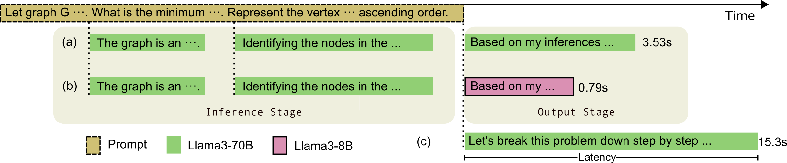

<p align="center">
  <h3 align="center"><strong>LiveMind: Low-latency Large Language Models with Simultaneous Inference</strong></h3>

<p align="center">
    Chuangtao Chen<sup>1</sup>,
    Grace Li Zhang<sup>2</sup>,
    XunZhao Yin<sup>3</sup>,
    Cheng Zhuo<sup>3</sup>,
    Ulf Schlichtmann<sup>1</sup>,
    Bing Li<sup>4</sup><br>
    <sup>1</sup>Technical University of Munich,
    <sup>2</sup>Technical University of Darmstadt<br>
    <sup>3</sup>Zhejiang Univerity,
    <sup>4</sup>University of Siegen
</p>


<div align="center">

<a href='https://arxiv.org/abs/2406.14319'></a> &nbsp;&nbsp;&nbsp;&nbsp;&nbsp;
 <a href='https://github.com/ChuangtaoChen-TUM/LiveMind/blob/master/LICENSE'></a> &nbsp;&nbsp;&nbsp;&nbsp;&nbsp;
</div>

<p align="center">
    
    <em><br>(a) LiveMind inference with Llama-3-70B model; (b) LiveMind collaborative inference with Llama-3-70B and Llama-3-8B models; (c) Conventional CoT inference.</em>
    <video src="https://github.com/ChuangtaoChen-TUM/LiveMind/assets/12672821/5670677b-7030-4584-b65d-4ee702c2d021" width="720" controls></video><em><br>A Demo with gradio of conventional Chain-of-Thought inference (left) and LiveMind simultanous inference (right) with streaming input. See `Playground` section for more information. </em>
</p>

## Contents
- [Contents](#contents)
- [Reproduce Experimental Results](#reproduce-experimental-results)
  - [Configurations](#configurations)
  - [Environment Configuration and Version Details](#environment-configuration-and-version-details)
  - [Reproduce the experimental results](#reproduce-the-experimental-results)
  - [Result analysis](#result-analysis)
- [Playground](#playground)
    - [Run Local LLama Models](#run-local-llama-models)
    - [Run OPENAI Models](#run-openai-models)
    - [Example](#example)
- [Citation](#citation)
## Reproduce Experimental Results
### Configurations
Install required packages:
```
pip install datasets nltk tqdm
```
Before running the script, you need to change the following configurations in `config.py` to set the LLMs and datasets:
1. `MMLU_PATH/MMLU_PRO_PATH`: path to the MMLU/MMLU-Pro dataset, the path should contains `.parquet` dataset files; 
2. To run `Llama-3-70B-Instruct` and `Llama-3-8B-Instruct` models, specify the paths `LLAMA_3_8B_PATH` and `LLAMA_3_70B_PATH` in the `config.py` file. A `config.json` file and `tokenizer.json` file should be found in these paths. Besides, make sure the packages `vllm` and `transformers` are installed;
3. To run OPENAI and CLAUDE models, make sure you have installed the required packages and set the api-keys. For more information, refer to the corresponding documents on their websites.
4. You can also use your own model, by configuring the `get_model` method: you can use your own model here as long it has the required method by `BaseModel` (see `config.py`);

### Environment Configuration and Version Details
1. The version of `gpt-4o` model used in the paper is `gpt-4o-2024-05-13`.
2. Local models used in the paper are in 4-bit AWQ quantized versions and can be downloaded from [Llama-3-70B-Instruct](https://huggingface.co/casperhansen/llama-3-70b-instruct-awq/), [Llama-3-8B-Instruct](https://huggingface.co/casperhansen/llama-3-8b-instruct-awq/)
3. The version of the `vllm` module is `0.5.3.post1`
4. The python version for the experiments is `Python 3.11.9 [GCC 9.4.0]`.
5.  The operating system and kernel used for the experiments is `Ubuntu 20.04.6 LTS Kernel: Linux 5.4.0-187-generic`.

### Reproduce the experimental results
To run an experiment, use command `python run_solver ...`. Use `python run_solver.py -h` for more information.

Commands to reproduce the results in the paper are listed in the `tasks.txt` file. See `tasks.txt` for more information.

### Result analysis
We provide a script to analyze the results, such as accuracy, latency and generation time. Use `python analyze.py <result_json_file>` to evalute the results. You can use glob pattern to analyze multiple files, for example:

```
python analyze.py ./output/mmlu/**sent**
```

## Playground
We provide an interactive playground implemented with **Gradio** framework.
To run the playground, make sure you have installed the `gradio` module.

Use `python run_playground.py --help` for more information.

#### Run Local LLama Models
To use the `llama-3-8b, llama-3-70b` model, you need to configure the model paths `LLAMA_3_8B_PATH` and `LLAMA_3_70B_PATH` in the `config.py` file and have the following modules installed:
`transformers, vllm` 

*The playground was tested on an Nvidia A100 80G, if you have enough memory but experience out-of-memory problem, consider change the memory utilization value (default: 0.6 for Llama-3-70B and 0.3 for Llama-3-8B) in `./playground/vllm_session/__init__/MODEL_DICT`*


#### Run OPENAI Models
To use OPENAI models, you need to install `openai` and set your API key using:
`export OPENAI_API_KEY="xxxxxxx"`.

#### Example
After setting the environment, you can run the playground and chat with the LLM. For example: `python run_playground.py -i llama-3-70b`

You can see the following interface:


You can type in the input textbox, and inferences made by the model will be displayed in the Action box in real-time. When you press enter to send the message, a response will be given in the chat_box area.

You can hide the action box (the inferences will still be made in background) or disable the LM framework by unchecking the check-boxes.

*Notice: currently we only support one round conversation (thought it is not difficult to extend the framework to multi-round conversations)*

## Citation

To cite our work:
```
@article{chen2024livemind,
      title={{LiveMind}: Low-latency Large Language Models with Simultaneous Inference},
      author={Chuangtao Chen and Grace Li Zhang and Xunzhao Yin and Cheng Zhuo and Ulf Schlichtmann and Bing Li},
      journal={arXiv preprint arXiv:2406.14319},
      year={2024},
}
```
